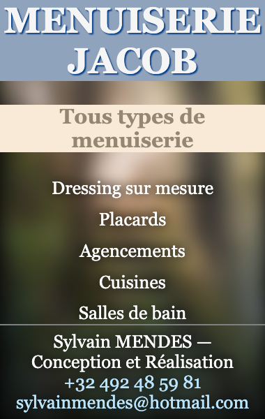
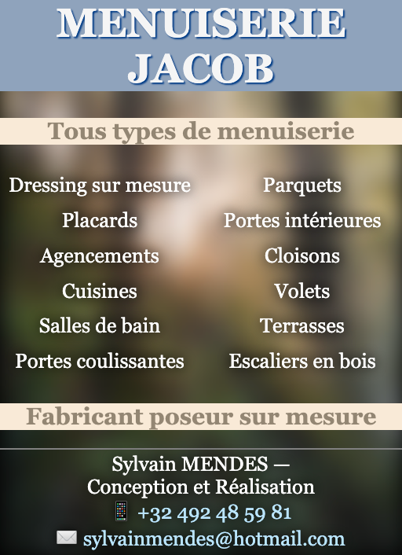
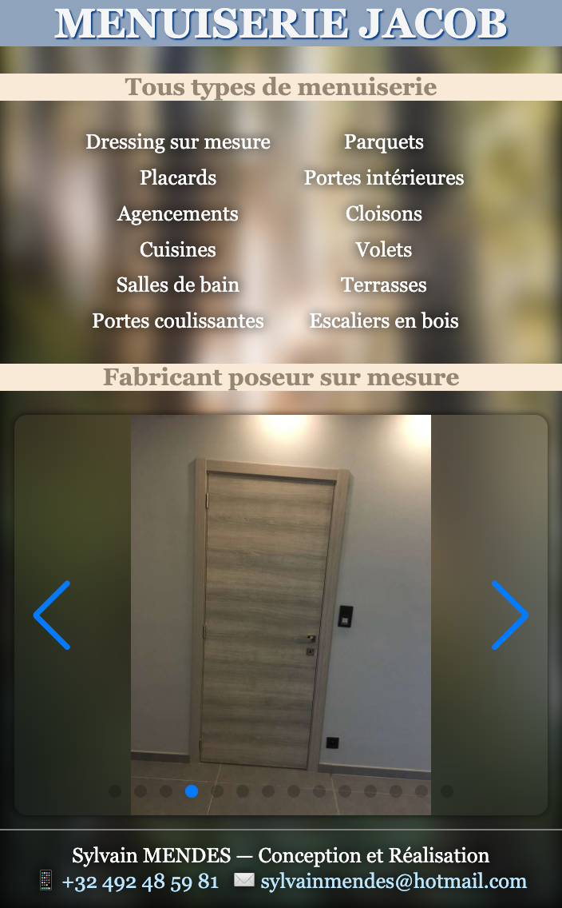
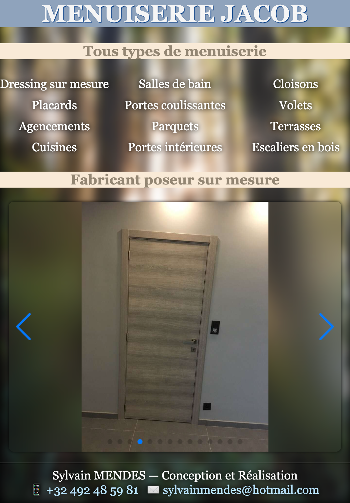
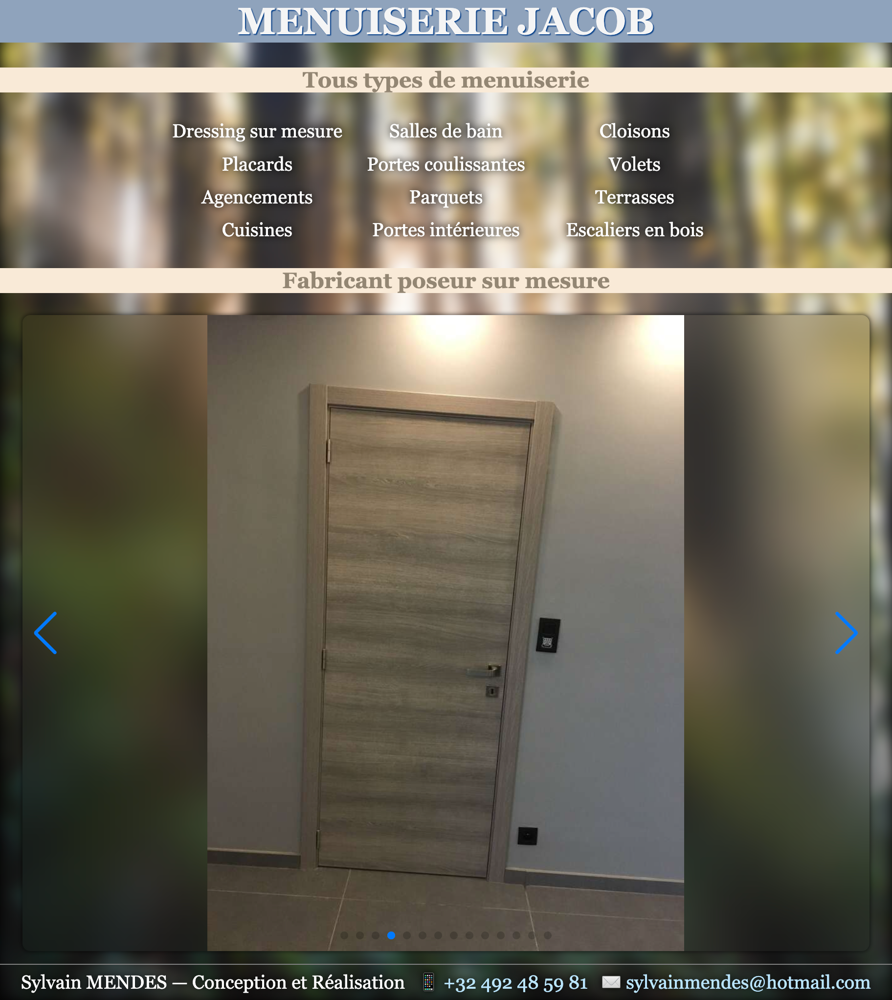

## Website

Built from main branch and deployed to GitHub Pages

https://nbros.github.io/Jacob.website/

## Resize images

https://imagemagick.org/script/mogrify.php

```shell
cd photos
magick mogrify -strip -resize 1024x1024 -quality 60 -path ../img *.jpg && du -sh ../img
```

## Website Screenshots

Responsive design

<table width='600px' style="font-size: 20px; text-align:center">
  <tr><td>380px</td><td>512px</td></tr>
  <tr>
    <td></td>
    <td></td>
  </tr>
  <tr><td>704px</td><td>1120px</td></tr>
  <tr>
    <td></td>
    <td></td>
  </tr>
  <tr><td colspan="2">1824px</td></tr>
  <tr>
    <td colspan="2"></td>
  </tr>
</table>